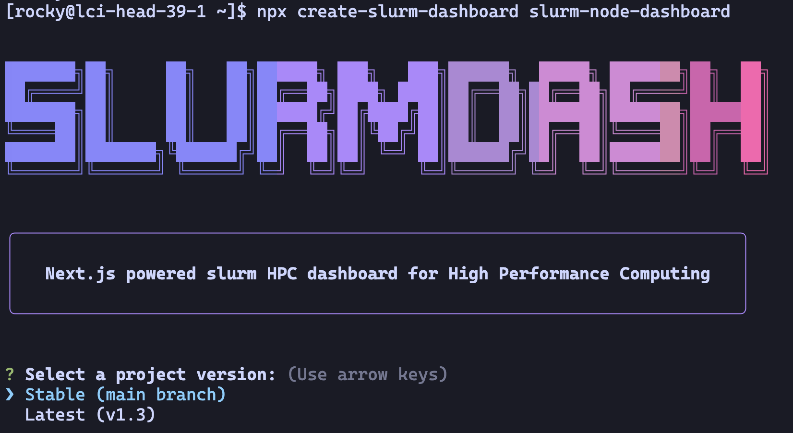
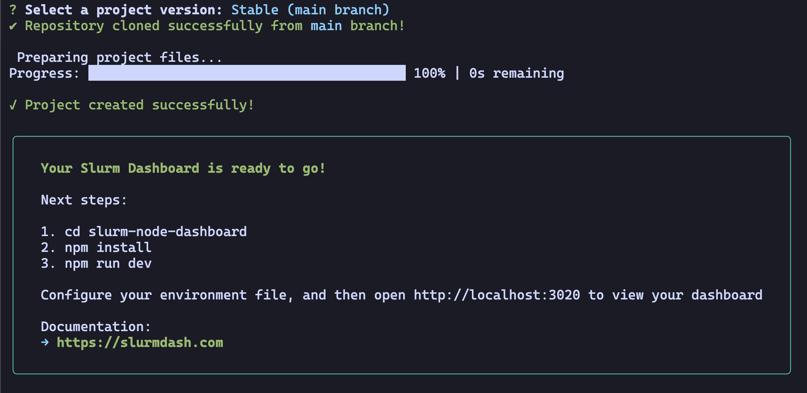

# Slurm Dash: HPC Dashboard Tutorial 2025

Welcome to the HPC Dashboard Tutorial! This guide will walk you through deploying and running the HPC Dashboard on your provided virtual machine (VM).

## HPC Dashboard Getting Started Guide

The HPC Dashboard is a Next.js application designed for real-time monitoring of Slurm nodes. It provides detailed insights into CPU/GPU utilization, node status, job histories, and more. This tutorial will guide you through deploying the most basic version of the dashboard on your lab VM.

**Note: All steps assume you are the rocky user on the head node unless otherwise specified.**

## Step 0: Ensure slurmrestd is fully configured

In a previous lab, slurmrestd was configured and setup to communicate with slurmctld by adding the JWT authentication to slurm.conf. However, we are missing a few configuration items to allow the slurmrestd to connect properly to slurmdbd.

Add the following lines to `/etc/slurm/slurmdbd.conf`:

```bash
AuthAltTypes=auth/jwt
AuthAltParameters=jwt_key=/var/spool/slurm.state/statesave/jwt_hs256.key,disable_token_creation
```

Ensure the following lines are present in `/etc/slurm/slurm.conf`:

```bash
AuthAltTypes=auth/jwt
AuthAltParameters=jwt_key=/var/spool/slurm.state/statesave/jwt_hs256.key,disable_token_creation
```

Ensure the key file exists and has the correct permissions:

```bash
sudo ls -l /var/spool/slurm.state/statesave/jwt_hs256.key
```

If the file does not exist, generate a new JWT key:

```bash
sudo mkdir -p /var/spool/slurm.state/statesave
sudo dd if=/dev/random of="/var/spool/slurm.state/statesave/jwt_hs256.key" bs=32 count=1 status=none
sudo chown slurm:slurm /var/spool/slurm.state/statesave/jwt_hs256.key
sudo chmod 750 /var/spool/slurm.state/statesave
sudo chmod 600 /var/spool/slurm.state/statesave/jwt_hs256.key
```

Restart slurmctld, slurmdbd, and slurmrestd to apply the changes:

```bash
sudo systemctl restart slurmctld slurmdbd slurmrestd
```

And verify all services are running:

```bash
sudo systemctl status slurmctld slurmdbd slurmrestd
```

## Step 1: Install Prerequisites

Slurm Dashboard requires Node.js version 19.x or higher. First, ensure your system is up to date and install the necessary packages to run the dashboard and serve it via NGINX with SSL support.

```bash
sudo dnf module enable nodejs:22
sudo dnf install -y npm nginx certbot
```

selinux will need to be configured to allow NGINX to make network connections:

```bash
sudo setsebool -P httpd_can_network_connect 1
```

## Step 2: Download the HPC Dashboard with NPX

```bash
cd /home/rocky
npx create-slurm-dashboard slurm-node-dashboard
```

This command uses NPX to scaffold the HPC Dashboard project in a directory called slurm-node-dashboard.

You will be prompted to select the version of the dashboard to install. Choose the `stable (main branch)` version and follow the prompts to complete the installation.





Note:

If you accidentally select the wrong version during the setup prompts, simply delete the slurm-node-dashboard directory and run the command again.

## Step 3: Install NPM Dependencies

```bash
cd slurm-node-dashboard
npm install
```

## Step 4: Obtain SLURM API Token

The dashboard requires a SLURM API token for authentication. Generate a token for the rocky user with an unlimited lifespan

```bash
sudo /opt/slurm/current/bin/scontrol token lifespan=infinite username=rocky
```

Note that we explicitly disabled users from creating tokens in slurm.conf, so an admin user must create the token for this unprivileged user. Generating tokens for an infinite lifespan is not recommended for production environments, but is acceptable for this lab setup.

Copy the generated token to your clipboard, as you will need it for the dashboard configuration.

## Step 5: Configure The Dashboard .env File

Set up the production environment by renaming the environment file, make sure to move the file to avoid having another environment causing conflicts:

```bash
mv .env.production .env
```

Then, update the .env file with your configuration:

```conf
COMPANY_NAME="LCI"
CLUSTER_NAME="ClusterXX"
CLUSTER_LOGO="/logo.png"

PROMETHEUS_URL=""

OPENAI_API_KEY=""
OPENAI_API_URL="https://api.openai.com/v1"
OPENAI_API_MODEL="gpt-4o-mini"

NODE_ENV="production"
REACT_EDITOR="code"

SLURM_API_VERSION="v0.0.40"
SLURM_SERVER="localhost"
SLURM_API_TOKEN="REPLACE_WITH_YOUR_SLURM_API_TOKEN"
SLURM_API_ACCOUNT="rocky"

ADMIN_USERNAME="admin"
ADMIN_PASSWORD="password"

MAINT_NOTIFICATIONS_ENABLED="true"
```

Note:

Do not expose your .env file or its contents in a public repository as it contains sensitive information like API keys and tokens.

## Step 6: Build the Dashboard

### Dev Build (Unavailable in todays setup)

In a local environment, we could start the development server with the following command `npm run dev` and view the dashboard at http://localhost:3020. However, since we are deploying on a remote VM with limited open ports, we will need to build the application for production in order to serve it via NGINX with SSL.

Note: Running npm run dev starts a development server that automatically reloads changes. This mode is ideal for testing and development but not for production.

### Production Build

We will be using pm2 to manage the application process in production. We need to install pm2 globally first, build the production version of the application, and then save the pm2 process list.

```bash
sudo npm install -g pm2
npm run build # This may take a few minutes

# Start the application with
pm2 start npm --name "hpc-dashboard" -- start -- --port 3020
pm2 save
```

PM2 is a process manager that ensures your application stays up and can restart automatically after crashes.
`npm run build` compiles the application for production, generating optimized static files.
`pm2 save` stores the current process list so that PM2 can resurrect these processes on server restart.

## Step 7: Configure NGINX with SSL to Serve the Dashboard over HTTPS

### Generate SSL Certificate

Generate a certificate using your hostname:

```bash
sudo certbot certonly --standalone --register-unsafely-without-email -d $(hostname -s).ncsa.cloud --agree-tos
```

### Create NGINX Configuration for the Dashboard

```bash
sudo cat > /etc/nginx/conf.d/slurmdash.conf << EOF
server {
    listen 443 ssl;
    server_name $(hostname -s).ncsa.cloud;

    ssl_certificate /etc/letsencrypt/live/$(hostname -s).ncsa.cloud/fullchain.pem;
    ssl_certificate_key /etc/letsencrypt/live/$(hostname -s).ncsa.cloud/privkey.pem;

    location / {
        proxy_pass http://127.0.0.1:3020;
        proxy_set_header Host \$host;
        proxy_set_header X-Real-IP \$remote_addr;
        proxy_set_header X-Forwarded-For \$proxy_add_x_forwarded_for;
        proxy_set_header X-Forwarded-Proto https;
    }
}
EOF
```

### Restart NGINX to apply the new configuration:

```bash
sudo systemctl enable --now nginx
sudo systemctl restart nginx
```

There should be no errors upon restart. If there are, check the NGINX configuration syntax with `sudo nginx -t`, and check the logs with `sudo journalctl -u nginx`

## Step 8: Access the Dashboard

Open your web browser and navigate to `https://lci-head-XX-1.ncsa.cloud/` (replace XX with your VM's identifier).

The interface includes:

Color scheme options (top right)
Menu access to historical data and modules pages
GitHub link for bug reports and forking

## Step 9: Submit a Test Job

Submit a few test jobs to see them reflected in the dashboard. 

```bash
sbatch -J tinyJob -p general -c 1 --mem=1G --time=00:02:00 --wrap="sleep 120"
sbatch -J tinyJob -p general -c 2 --mem=1G --time=00:02:00 --wrap="sleep 120"
sbatch -J tinyJob -p general -c 2 --mem=1G --time=00:02:00 --wrap="sleep 120"
sbatch -J smallJob -p general -c 2 --mem=4G --time=00:05:00 --wrap="sleep 300"
sbatch -J bigJob -p general -c 2 --mem=7G --time=00:10:00 --wrap="sleep 600"
```

Click on the nodes to see the detailed view of jobs running on each node.

## Step 10: Take A Node Offline

To see how the dashboard reflects node status changes, take a node offline using the `scontrol` command:

```bash
sudo -i
scontrol update nodename=compute-0-1 state=down reason="Testing dashboard offline status"
```

## Step 11: Create a Maintenance Notification

Create a maintenance reservation using the `scontrol` command and then, refresh the dashboard in your web browser.

```bash
sudo -i
scontrol create reservationname=maint starttime=now+60minutes duration=60 nodes=ALL users=root flags=maint
```

This will create a maintenance reservation starting in 60 minutes for 1 hour on all nodes that only root can access.

You should see a notification banner on the dashboard indicating the upcoming maintenance. This notification is only present for reservations that contain the `maint` flag. The notification will automatically disappear once the maintenance window has passed, and will only be shown to users once every 24 hours.

This is an optional feature of the dashboard that can be enabled or disabled via the `.env` file by setting `MAINT_NOTIFICATIONS_ENABLED` to `true` or `false`.

You can delete the reservation with:

```bash
sudo -i
scontrol delete reservationname=maint
```

## Additional Resources

- Slurm Dashboard Website: [slurmdash.com](https://www.slurmdash.com/)
